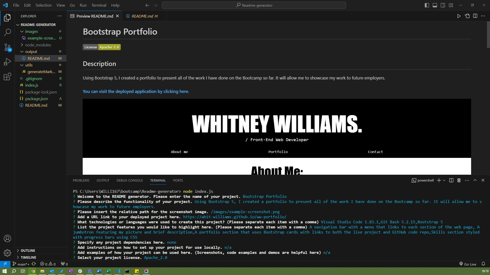

# The README Generator

Welcome to The README Generator App.

Following on from our lesson on ES6 and Node.js, I have created a README generator using npm Inquirer and Node.js.

## About The Project

The task for this challenge was to build an application that allows a user to generate a README markdown file for their project by answering questions prompted by Inquirer using the command line. Once the file is generated it is then saved to a folder called "output".

### Acceptance Criteria
- Create a command-line application that accepts user input.
- When a user is prompted for information about the application repository then a high-quality, professional README.md is generated with: A project title and Description, Table of Contents, Installation, Usage, License, Contributing,Tests and Questions sections.
- When a user enters the project title then it is displayed as the title of the README
- When a user enters a description, installation instructions, usage information, contribution guidelines, and test instructions then this information is added to the sections of the README entitled Description, Installation, Usage, Contributing, and Tests.
- When a user chooses a license for their application from a list of options then a badge for that license is added near the top of the README and a notice is added to the section of the README entitled License that explains which license the application is covered under.
- When a user enters their GitHub username then this is added to the section of the README entitled Questions, with a link to their GitHub profile
- When a user enters their email address then this is added to the section of the README entitled Questions, with instructions on how to reach them with additional questions.
- When a user clicks on the links in the Table of Contents then they are taken to the corresponding section of the README.

### Technologies
This project is created with:

- Visual Studio Code 1.83.1
- Git Bash 5.2.15
- Node.js
- npm Inquirer

### Key Features
- Displays prompts in the terminal using Node.js
- Answers are saved to a new README file, follwing a professional format
- Displays project license badge at the top of the README file

### How to Use This Application
[Please visit this link to watch a video walkthrough on how use this application](https://www.awesomescreenshot.com/video/24089493?key=42a802c2fcc37f2d7e5f6f385230e30d)

### Credits 
- [npm Inquirer itself](https://github.com/SBoudrias/Inquirer.js/blob/master/packages/inquirer/README.md)
- [Displaying license badges](https://gist.github.com/lukas-h/2a5d00690736b4c3a7ba)
- [Formatting answers into bullet points](https://stackoverflow.com/questions/73603668/how-do-i-format-data-from-an-inquirer-output-into-markdown-file)

### License 
None
